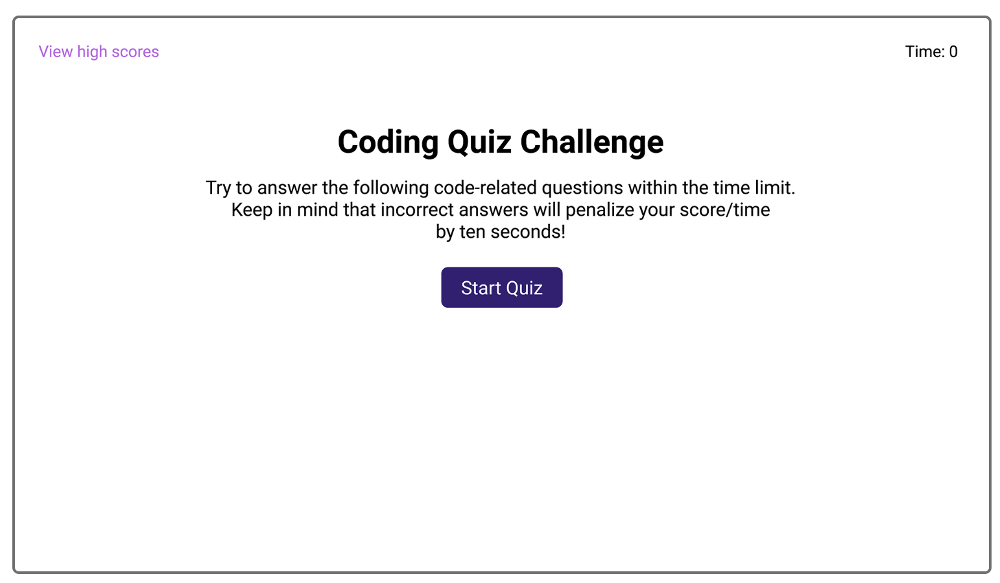

# Kevin-Reid- Coding Quiz

This page includes a coding quiz:

The quiz will have a timer.
You will be prompted with questions to answer.
Answer correctly and move onto the next question.
Answer incorrectly and be penalized 10 seconds on the timer.
You will be scored, and have the chance to put in your initials and save your score.
High scores can also be viewed.

Link to the page is here: https://vinyldude8896.github.io/Coding-Quiz/